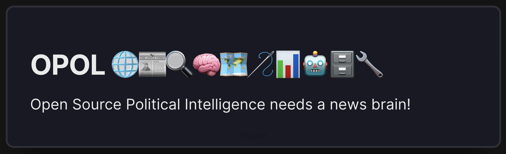

**On a mission to find the #NeedleInTheHayStack**

Opol is the data engine for Open Politics—an open-source, self-hostable solution designed to orchestrate public intelligence operations (O(P)SINT). We combine data engineering, political science, and OSINT best practices to collect, process, and analyze a wide variety of open-source data related to politics, geopolitics, economy, legislation, and more. Our goal is to offer a comprehensive resource that supports deep political, data-driven analyses and fosters transparency.

## Table of Contents
- [Introduction](#introduction)
- [Features](#features)
- [Data Coverage](#data-coverage)
- [This Repository](#this-repository)
  1. [Python Client](#python-client)
  2. [The Stack](#the-stack)
- [Quick Installation and Usage](#quick-installation-and-usage)
- [Example Usage](#example-usage)
- [Further Documentation](#further-documentation)
- [Contributing](#contributing)
- [License](#license)


## Introduction
### What is O(P)SINT?
Open Source Political Intelligence (O(P)SINT) is a specialized form of OSINT, tailored for political analysis. It integrates:

- **Data engineering** for large-scale data processing and management
- **Political science** for structuring, analyzing, and interpreting politically relevant data
- **Open-source principles** ensuring community-driven improvements, transparency, and extensibility

### Why Opol?
- **Better Data Access**: A robust platform that centralizes data from multiple sources (news, economic statistics, polls, legislation).
- **Scalable & Modular**: Microservice architecture, container-based deployment, and a flexible pipeline orchestrated via Prefect.
- **Extendable**: Easily add your own sources, classification schemes, or transformations.
- **Transparency & Community**: This is a public intelligence operation—community contributions and reviews are welcomed.

## Features
Opol tackles the entire data lifecycle—from ingestion to analysis—and exposes interfaces for advanced capabilities:

- **Scraping**: Collect data such as news, economic metrics, polls, and legislation from specified sources.
- **Embeddings**: Transform text into vector embeddings for semantic search and deeper NLP tasks.
- **Entity Extraction**: Identify people, locations, organizations, geo-political entities, and more.
- **Geocoding**: Convert recognized locations into latitude-longitude data for mapping or geospatial analysis.
- **LLM Classifications**: Classify documents using large language models to annotate content with event types, topics, or relevance scores.
- **Vector Database**: Index semantic embeddings in a specialized store (e.g., pgvector) for robust text similarity queries.
- **SQL Database**: Store article metadata (topics, entities, classification scores, events) in a relational database.
- **Utilities**: Helpers like generating GeoJSON, using SearXng for meta-search, or hooking up to any LLM for contextual retrieval.

## Data Coverage
Because global coverage is huge, we focus on building reliable, modular methods that can be extended to new geographies and data sets. Current efforts are aimed at:

- **Germany and the European Union (EU)**:
  - Legislative data (Bundestag, EU Parliament)
  - Economic and polls
- **International**:
  - Focus on the Middle East, Eastern Europe, Africa, and Asia for major geopolitical news
  - OECD-based economic data ingestion (e.g., GDP and GDP Growth)

We encourage public contributions to add new sources, modules, or classification schemes—ensuring transparency and accountability in how and what we collect.

## This Repository
This repo (named opol) contains two core components:

### Python Client
A user-friendly interface to interact with the Opol engine. You can install it from PyPI (`pip install opol`) and integrate it in your Python scripts or Jupyter notebooks.

### The Stack
A Docker + FastAPI microservice stack orchestrated by Prefect. It powers the ingestion, transformation, classification, geocoding, and search functionalities.

For advanced usage, environment configurations, and microservice definitions, see the opol/stack documentation.

## Quick Installation and Usage
Below is a minimal quickstart for local setup. For advanced usage, see the [Stack Documentation](opol/stack/README.md).

**Install the Python client:**
```bash
pip install opol
```

**Clone the Repository & Boot the Stack** to self-host: \
*(Needs ~32G of RAM)*
```bash
git clone https://github.com/open-politics/opol.git
cd opol/opol/stack
mv .env.example .env

# Boot with local Prefect server for orchestration
docker compose -f compose.local.yml up --build
```

**Use the Python client in your code**
Just switch mode="local" to connect to your local stack or use the default remote.

```python
from opol import OPOL

opol = OPOL(mode="local")
...
```

## Example Usage
Here are some quick code samples to showcase what Opol can do:

**Fetch articles:**

```python
from opol import OPOL

opol = OPOL(mode="local")
articles = opol.articles.get_articles(query="apple")
for article in articles:
    print(article) # or print(article['title])
```

**Render events as GeoJSON for a specified event type:**

```python
geojson = opol.geo.json_by_event("War", limit=5)
print(geojson)
# Returns a FeatureCollection with geometry & properties
**Geocode a location:**

```python
location = "Berlin"
coordinates = opol.geo.code(location)["coordinates"]
# [13.407032, 52.524932]
print(coordinates)
```

**Fetch Economic Data (OECD):**

```python
econ_data = opol.scraping.economic("Italy", indicators=["GDP"])
print(econ_data)
```

**Get Summarized Poll Data:**

```python
polls = opol.scraping.polls("Germany", summarised=True)
for poll in polls:
    print(f"Party: {poll['party']}, Percentage: {poll['percentage']}")
```

## Further Documentation

[**Opol Stack:**](opol/stack/README.md) For details on microservices, flows, environment variables, and more, head to the opol/stack directory.

[**Data Structure:**](opol/stack/core/models.py) Implementation references for news source content, [classification schemes](opol/stack/core/classification_models.py), entity extraction, etc.

[**Notebook Examples:**](opol/python-client/prototype.ipynb) Jupyter Notebook Prototype demonstrating typical usage scenarios.

## Contributing
We’re building Opol as a community-driven project. Whether you’re a developer, data scientist, political researcher, or simply interested in public intelligence operations, you’re welcome to contribute. Please open an Issue or Pull Request with your ideas and improvements.

How you can help:

- Add new scrapers for different news sites or legislative data
- Propose or refine classification prompts
- Improve data coverage for less represented countries
- Contribute to documentation, scripts, or code

## License
Opol is released under the MIT License. You’re free to use, modify, and distribute this software in any personal, academic, or commercial project, provided you include the license and its copyright notice.

