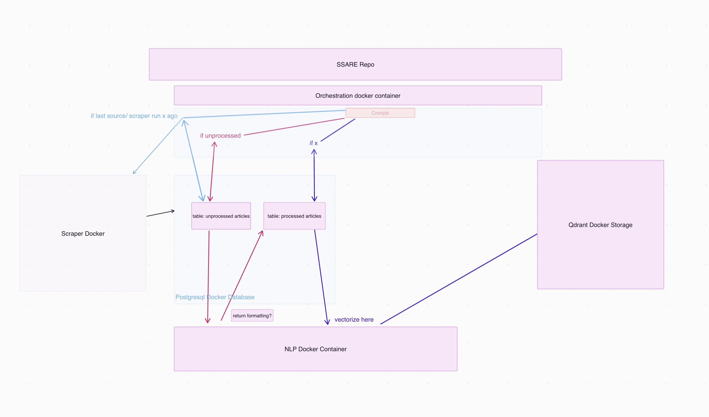

# SSARE
Semantic Search Article Recommendation Engine

## About this project
SSARE is an open-source information architecture designed to autonomously aggregate, store and semantically search news articles. With a focus on political discourse, SSARE aims to provide a scalable open-source infrastructure to scrape news for researchers and data scientists.

The proposition:
- By providing any sourcing or scraping script that produces the "column", "url", "headline", and "paragraphs".
- The project grows with every scraper, enhancing the infrastructure to acquire, store, and query the articles.
- Qdrant is used for the semantic search, and PostgreSQL for storage.

## Roadmap (upcoming) 



## Overview


## Contribution: Article Input Scripts
We are actively seeking contributions from data scientists and coders, particularly in the realm of article input scripts. By writing scripts that scrape, process, and standardize news articles, you can help us expand our database and improve the breadth of our political news coverage.


## Usage
run and build with docker-compose
Run full.py to test the services.
If you have a scraper script, the expected format are the columns: url, headline, paragraphs.
Put the script into 
```
SSARE/scraper_service/scrapers
```
and add the location to the config at
```
SSARE/scraper_service/scrapers/scrapers_config.json.
```

## Note
The scraper service is not yet round. The orchestration service not written.
Querying is the databases is not yet implemented.

## Storage
The storage is postgresql and qdrant. Both can be used to retrieve/ query.
Suggestion right now: recommend with qdrant, deliver with postgres.

## Architecture
The services communicate with api calls and data is pushed to redis queues. 
A more detailed description will follow.


## License
SSARE is licensed under the MIT License - see the LICENSE file for details.