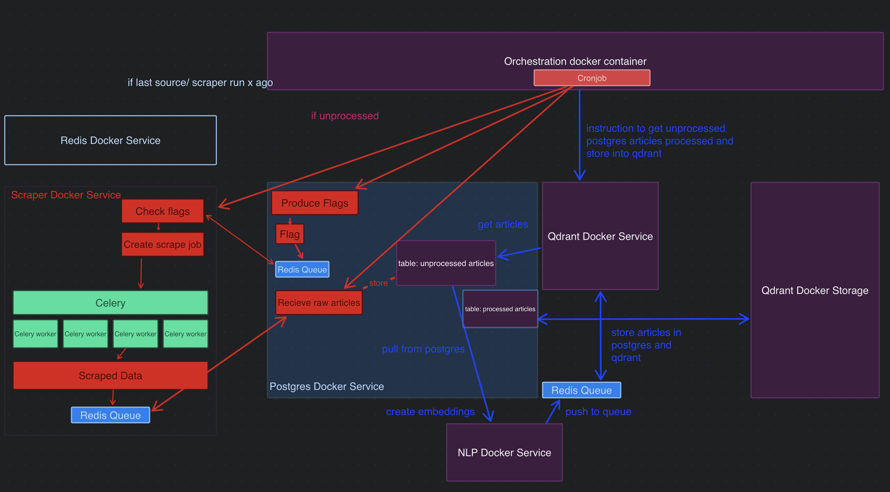

# SSARE
Semantic Search Article Recommendation Engine

## About this project
SSARE is an open-source information architecture designed to autonomously aggregate, store, and semantically search news articles. Focusing on political discourse, SSARE aims to provide a scalable open-source infrastructure for scraping news, adressing researchers, data scientists and internet activists.

The Proposition:

By providing any sourcing or scraping script that produces the columns "url", "headline", and "paragraphs", the project can be extended to any news source.
The project expands with each scraper, enhancing the infrastructure for acquiring, storing, and querying articles.
Qdrant is utilized for semantic search, and PostgreSQL for storage.

## Roadmap (upcoming) 



## Overview

## Contribution: Article Input Scripts
We are actively seeking contributions from data scientists and coders, particularly in the realm of article input scripts. By writing scripts that scrape, process, and standardize news articles, you can help us expand our database and improve the breadth of our political news coverage.


## Usage
Run and build with docker-compose.
```
docker-compose up --build
```
Run full.py to test the services (currently only cnn)
```
python full.py
```
If you have a scraper script, the expected format are the columns: url, headline, paragraphs.
Put the script into 
```
SSARE/scraper_service/scrapers
```
and add the location to the config at
```
SSARE/scraper_service/scrapers/scrapers_config.json.
```
and the orchestration service will run it (upcoming).


## Note
The scraper service is not yet round. The orchestration service not written.
Querying is the databases is not yet implemented.
You can access each API endoint independently.

## API / Service Map
### Services
#### redis
Redis is used as the backend for inter-service queues.
The channels communicate via lrange and rpop.
The celery workers also use redis as their backend.
#### main core app
This service will later orchestrate the composition of microservices by scheduling tasks, checking in on queues and calling apis to trigger processes.
#### postgres service
The postgres service can produce flags (e.g. "cnn") if triggered and put them into a redis task queue. It also stores the articles for fast retrieval and as a general intermediate storage.
#### postgres database
This service is the image
#### scraper service
This service reads from the redis queue where the flags for scraping jobs are stored. It instructs celery to create async scraping jobs for the flag by running the corresponding scripts (retrievable via the location in the scrapers-config.json).
#### qdrant service
This service creates jobs to vectorise the articles (by sending them to the nlp service). It handles the upsert and querying logic of qdrant.
#### qdrant storage
This service is Qdrant's storage. It 

## Storage
The storage is postgresql and qdrant. Both can be used to retrieve/ query.
Suggestion right now: recommend with qdrant, deliver with postgres.

## Architecture
The services communicate with api calls and data is pushed to redis queues. 
A more detailed description will follow.


## License
SSARE is licensed under the MIT License - see the LICENSE file for details.

