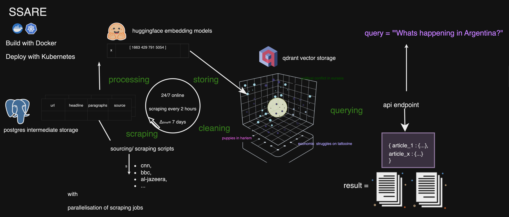

# SSARE 
🌐🔍🪡 Finding the needle in the haystack
# Semantic Search Article Recommendation Engine
Always up-to-date news RAG endpoint for semantic search and article recommendations.


## Introduction
SSARE stands for Semantic Search Article Recommendation Engine, an open-source service that comfortably orchestrates scraping, processing into vector representations and querying of news articles. 

SSARE serves as an efficient and scalable resource for semantic search and article recommendations, catering primarily to news data.

SSARE is an always up to date political news RAG endpoint.

The engine is adaptable to various sources, requiring only a sourcing cript that outputs the data in the format of a dataframe with the columns "url," "headline," and "paragraphs." Once integrated, SSARE processes these articles using embeddings models of your choice(upcoming, currently hardcoded), stores their vector representations in a Qdrant vector database, and maintains a full in a PostgreSQL database. 

SSARE is a composition of microservices to make this project a scalable and maintainable solution.

This is a high-level overview of the architecture:



For a more detailed overview, please refer to the [Architecture and Storage](#architecture-and-storage) section.


## Version 1 Deployment
We are excited to announce that SSARE version 1 is now operational and usable!

### Getting Started
Ensure Docker and docker-compose are installed.

Then:
1. Download the source code by cloning the repository.
    ```bash
    git clone https://github.com/JimVincentW/SSARE.git
    ``` 
2. Initiate the setup:
   ```bash
   cd SSARE
   docker-compose up --build
   ```
3. Execute the initial setup script:
   ```bash
   python full.py
   ```
   Wait (initial scraping/ processing may take a few minutes).
4. Query the API:
   ```bash
   curl -X GET "http://127.0.0.1:6969/search?query=Argentinia&top=5"
   ```

The design philosophy underscores flexibility, allowing integration with any scraper script that aligns with the specified data structure. The infrastructure benefits from each additional source, enriching the system's capability to amass, store, and retrieve news content efficiently.

## Upcoming Features

### Future Roadmap
The project's trajectory includes plans for enhanced service orchestration (with Kubernetes) and expanded scraper support, all aimed at bolstering the engine's functionality and reach.

### Participation: Script Contributions
We welcome contributions from passionate activists, enthusiastic data scientists, and dedicated developers. Your expertise can greatly enhance our repository, expanding the breadth of our political news coverage. 

## Practical Instructions
Here's a concise guide to starting up SSARE:

- Deploy and construct the environment using:
  ```bash
  docker-compose up --build
  ```
- Verify service functionality:
  ```bash
  python full.py
  ```
- For custom scraper integration, scripts should yield "url," "headline," "paragraphs." and "source". Store your script at:
  ```
  SSARE/scraper_service/scrapers
  ```
  Update the scraper configuration accordingly:
  ```
  SSARE/scraper_service/scrapers/scrapers_config.json
  ```
  The orchestration service will process your script once implemented.

If your additional scripts need scraping libraries other than BeautifulSoup, please add them to the requirements.txt file in the scraper_service folder (and create a pull request).

## Important Notes
Current limitations include the limited number of scrapers, alongside the unavailability of querying the postgres database directly.


## Architecture and Storage
SSARE's architecture fosters communication through a decoupled microservices design, ensuring scalability and maintainability. The system is composed of the following services:
- [] (details to be added)

The scrape jobs are created with Celery. 

Regarding storage, SSARE employs PostgreSQL for data retention and Qdrant for semantic recommendations, ensuring a robust and responsive search and retrieval system.

## Licensing
SSARE is distributed under the MIT License, with the license document available for reference within the project repository.