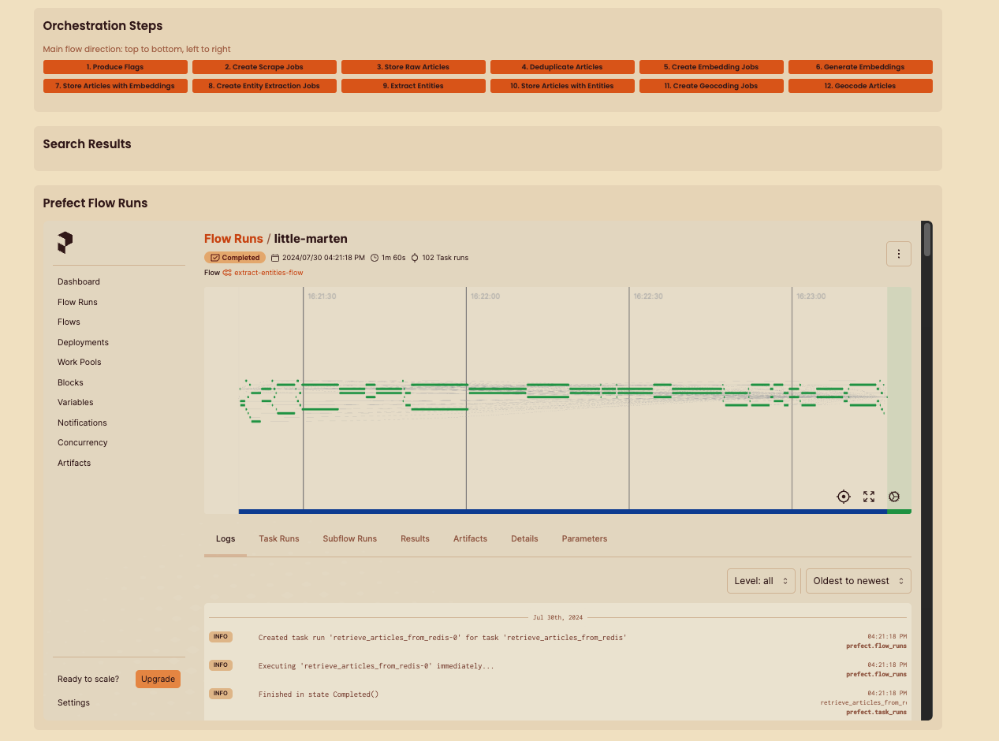

   <h1>SSARE 🌐📰🔍🧠🗺️🪡📊🤖🗄️🔧</h1>Open Source Political Intelligence needs a news brain! 

On a mission to find the **#NeedleInTheHayStack**

**SSARE** stands for Semantic **Search Article Recommendation Engine**: 

an open-source service that comfortably orchestrates: \
    - scraping of arbitrary sourcing scripts \
    - processing into vector representations \
    - Named Entity Recognition (like locations, persons, organisation, geo.-pol. entities) \
    - geocoding of recognized locations \
    - storing \
    - and querying of news articles.

**Delivering:**  
    - An up to date Vector Search news retrieval endpoint for RAG/ LLM applications \
    - An up to date news SQL database for lots of other applications \
    - A resource to track entities over arbitrary sources with simple sorting scripts (like affiliations, organisations) \
    - Geojson for article locations or related entities on a map

**Spin up your own news brain!**

- [Introduction](#introduction)
- [Installation](#installation)
- [Adding Sources](#adding-sources)
- [Architecture and Storage](#architecture-and-storage)
- [Flow Orchestration with Prefect](#flow-orchestration-with-prefect)
- [High Level Diagram](#high-level-diagram)
- [Services](#services)
- [Usage](#usage)
- [Use Cases](#use-cases)
    - [Entity Ranking](#entity-ranking)
    - [GeoJSON](#geojson)
- [Future Roadmap](#future-roadmap)
- [Participation: Script Contributions](#participation-script-contributions)
- [Important Notes](#important-notes)
- [Licensing](#licensing)


***Semantic Search Engine?** \
**Semantic Search** is a process that retrieves related articles by contextual similarity of situations described in natural language. A retrieval technique which opens **up new paradigms of information ranking and retrieval**. It is a quite popular choice ***to enhance Large Language Models with a "memory"*** of relevant articles. This project hopes to combine the amenities of a classical SQL database with a vector database and deliver a **useful, scalable and collectively engineered data stream** that is unprecedented.*


## Introduction

SSARE serves as an efficient and scalable resource for semantic search and article recommendations, catering primarily to political news data.

The engine is adaptable to any article/ document, requiring only a sourcing script that outputs the data in the format of a dataframe with the columns: 

**|| url | headline | paragraphs | source ||** < - This is all your script needs to produce
Once integrated, SSARE processes these articles using embeddings models of your choice (upcoming, currently hardcoded), stores their vector representations in a Qdrant vector database, and maintains a full copy in a PostgreSQL database. 

Furthermore all articles' text is undergoing Named Entity Recognition (NER) where entities such as geo-political entities, affiliations, persons or organisation names.

The GPE (Geoplolitical Entity) tags are the geoencoded, e.g. for the recognised location "Berlin" it returns the latitude and longitude and passes a geojson file.

**THE FINAL RESULT** is a live postgres database with articles saved and this data schema (as pydantic model):
````python
class Article(Base):
    __tablename__ = "articles"
    url = Column(String, primary_key=True)  # Url & Unique Identifier
    headline = Column(String)  # Headline
    paragraphs = Column(String)  # Text
    source = Column(String)  # 'cnn'
    embeddings = Column(ARRAY(Float))  # [3223, 2342, ..]
    entities = Column(JSONB)  # JSONB for storing entities
    geocodes = Column(ARRAY(JSONB))  # JSON objects for geocodes
    embeddings_created = Column(Integer, default=0)  # Flag
    stored_in_qdrant = Column(Integer, default=0)  # Flag
    entities_extracted = Column(Integer, default=0)  # Flag
    geocoding_created = Column(Integer, default=0)  # Flag
````

PLUS

A qdrant vector storage that retrieves articles by semantic search:


That can be used in a lot of ways already, have fun!


## High Level Diagramm:


(A bit outdated, no NER & Geocoding here, will swap asap)


## Introduction
Before we can make use of our own scraping intelligence brain. Let's install it.
### Install
1. Download the source code by cloning the repository.
    ```bash
    git clone https://github.com/JimVincentW/SSARE.git
    ``` 
2. Initiate the setup:
   ```bash
   cd SSARE
   docker-compose up --build
   ```
2. Go to the dashboard under
```bash
http://localhost:8089/
```
```bash
or when inside the same docker network:
http://main_core_app:8089/
````
Here you can trigger the scraping process, overview the redis channels, search the articles and observe the prefect dashboard where the tasks are executed.





## EASY! Add any source
Insert any sourcing or scraping script into the scraper_service/scrapers folder. 
A simple scraping script can look like this:
```python
import requests
from bs4 import BeautifulSoup
import pandas as pd

def scrape_cnn_articles():
    base_url = 'https://www.cnn.com'
    response = requests.get(base_url)
    soup = BeautifulSoup(response.text, 'html.parser')
    
    article_links = [a['href'] for a in soup.find_all('a', href=True) 
                     if a['href'].startswith('/2024/') and '/politics/' in a['href']]
    
    articles = []
    for link in article_links:
        article_url = base_url + link
        article_response = requests.get(article_url)
        article_soup = BeautifulSoup(article_response.text, 'html.parser')
        
        headline = article_soup.find('h1', class_='headline__text')
        headline_text = headline.text.strip() if headline else 'N/A'
        
        paragraphs = article_soup.find_all('div', class_='article__content')
        article_text = ' '.join([p.text.strip() for p in paragraphs])
        
        articles.append({
            'url': article_url,
            'headline': headline_text,
            'paragraphs': article_text,
            'source': 'cnn'
        })
    
    df = pd.DataFrame(articles)
    return df


# Usage
cnn_articles_df = scrape_cnn_articles()
cnn_articles_df.to_csv('cnn_articles.csv', index=False)
```
## Architecture and Storage
SSARE's architecture fosters communication through a decoupled microservices design, ensuring scalability and maintainability.Redis stores task queues. The system is composed of the following services:
-  Scraper Service
-  Vectorization/NLP Service
-  Qdrant Service
-  PostgreSQL Service
-  Entity Service
-  Geocoding Service
-  API Service

Services communicate and signal each other by producing flags and pushings tasks and data to Redis queues.

The scrape jobs are parallelized with Celery (fading out), Prefect (fading in) and async functions where possible. 

Regarding storage, SSARE employs PostgreSQL for data retention and Qdrant as a vector storage.

A simpler and wholistic data contract solution for project-wide usage would be greatly appreciated.


## Prefect Orchestration
You can track and modify the orchestration of the different large-scale flows with prefect. 
You can for example change the taskrunner in the scraper service from 
flow(task_runner=SequentialTaskRunner())
def scrape_data_task(flags):
    for flag in flags:
        scrape_single_source.submit(flag)
        logger.info(f"Scraping data for {flag} complete")
    logger.info("Scraping complete")

to for example a limited ConcurrentTaskRunner, Keep in mind your hardware capabilities.
Ray can orchestrate your heavier workflows on a even more distributed level. 


SSARE will execute all scripts in the scrapers folder and process the articles. 
They are vectorized and stored in a Qdrant vector database.
The API endpoint can be queried for semantic search and article recommendations for your LLM or research project.


The design philosophy underscores flexibility, allowing integration with any scraper script that aligns with the specified data structure. The infrastructure benefits from each additional source, enriching the system's capability to amass, store, and retrieve news content efficiently.

## Use Cases:

1. Entity Ranking
Use the provided script to retrieve entities most prominent in your data, here 'NORP' - 'affiliation':
   ```python
   import requests
   from collections import Counter, defaultdict

   def print_sorted_gpe_entities(x):
       url = 'http://localhost:5434/articles'
       params = {
           'geocoding_created': 0,
           'limit': 200,
           'embeddings_created': 1,
           'entities_extracted': 1
       }

       entity_type = 'NORP'
       response = requests.get(url, params=params)
       if response.status_code == 200:
           data = response.json()

           gpe_counter = Counter()
           gpe_articles = defaultdict(list)

           for article in data:
               entities = article['entities']
               for entity in entities:
                   if entity['tag'] == entity_type:
                       entity_name = entity['text']
                       gpe_counter[entity_name] += 1
                       if article['headline']:
                           gpe_articles[entity_name].append(article['headline'])
                       else:
                           gpe_articles[entity_name].append(article['url'])

           sorted_gpes = gpe_counter.most_common(x)
           sorted_gpes = list(reversed(sorted_gpes))
           for gpe, count in sorted_gpes:
               print(f"{entity_type}: {gpe}, Count: {count}")
               print("Associated Articles:")
               for article in set(gpe_articles[gpe]):
                   print(f" - {article}")
               print("\n")
       else:
           print('API request failed.')

   print_sorted_gpe_entities(10)
   ```

This script, sorting for NORP (affiliation) will return an output like this:
````text

NORP: Republicans, Count: 17
Associated Articles:
 - Biden left without an easy solution as campus protests heat up
 - House Democrats announce they would save Speaker Mike Johnson if Marjorie Taylor Greene triggers her effort to oust him
 - Arizona Senate votes to repeal Civil War-era near-total abortion ban


NORP: Israeli, Count: 19
Associated Articles:
 - Blinken met Netanyahu in Israel as US ramps up push for a ceasefire deal
 - Biden left without an easy solution as campus protests heat up


NORP: Democratic, Count: 19
Associated Articles:
 - Biden presents Medal of Freedom to key political allies, civil rights leaders, celebrities and politicians
 - House Democrats announce they would save Speaker Mike Johnson if Marjorie Taylor Greene triggers her effort to oust him
 - Arizona Senate votes to repeal Civil War-era near-total abortion ban
 - Takeaways from Day 10 of the Donald Trump hush money trial
 - Who is Hope Hicks, longtime Trump aide who is testifying in NY hush money case?
 - Biden left without an easy solution as campus protests heat up


NORP: Indian, Count: 20
Associated Articles:
 - Thomas Cup 2024 QF Highlights: Lakshya the solitary winner as India’s title defence ends 1-3 after defeat against China
 - India T20 World Cup Squad Press Conference: Ajit Agarkar says Rinku Singh and Shubman Gill have done ‘nothing wrong’
 - "Daughters Lost": Ex Wrestler After BJP Fields Brij Bhushan's Son In Polls
````
You can sort, mix, match and filter over these entitues:
````json
    tag_meaning = {
        'CARDINAL': 'cardinal value',
        'DATE': 'date value',
        'EVENT': 'event name',
        'FAC': 'building name',
        'GPE': 'geo-political entity',
        'LANGUAGE': 'language name',
        'LAW': 'law name',
        'LOC': 'location name',
        'MONEY': 'money name',
        'NORP': 'affiliation',
        'ORDINAL': 'ordinal value',
        'ORG': 'organization name',
        'PERCENT': 'percent value',
        'PERSON': 'person name',
        'PRODUCT': 'product name',
        'QUANTITY': 'quantity value',
        'TIME': 'time value',
        'WORK_OF_ART': ''
    }
````


2. GeoJSON

Produce a set of features derived from the locations present in your data. This can enable visualisations like open politics "Open Globe" interface (with the json intentionally displayed):


### Roadmap
The project's trajectory includes plans for enhanced service orchestration (with Kubernetes) and expanded scraper support (looking forwards to creating "flavours" of information spaces), all aimed at bolstering the engine's functionality and reach.

- [x] Scraping of arbitrary sourcing scripts
- [x] Processing into vector representations
    - [] Custom embedding models
- [x] Named Entity Recognition (locations, organizations, geo-political entities)
- [ ] Geocoding of recognized locations
- [x] Storing and querying of news articles with
    - [x] Querying by entity
    - [x] Vector Search


### Participation: Script Contributions
We welcome contributions from passionate activists, enthusiastic data scientists, and dedicated developers. Your expertise can greatly enhance the project, expanding the breadth of our political news coverage. 


If you want to use your own embeddings models, you need to change the dim size in the code of the qdrant service and the model name in the nlp service.

## Important Notes
Current limitations include the limited number of scrapers, alongside the unavailability of querying the postgres database directly.


## Licensing
SSARE is distributed under the MIT License, with the license document available for reference within the project repository.
